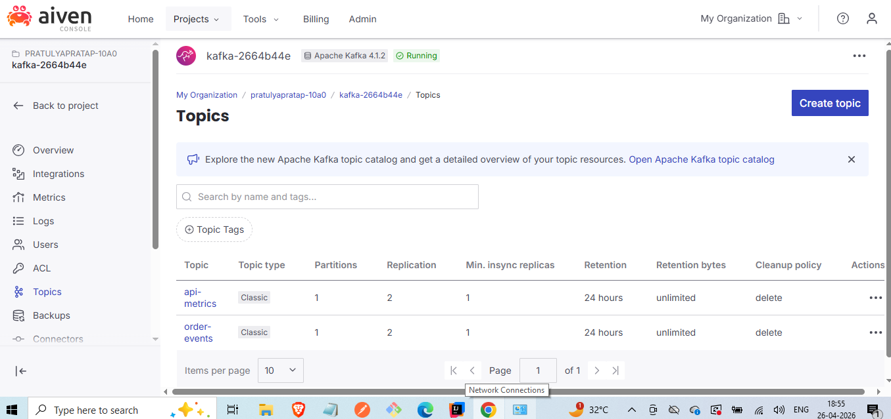
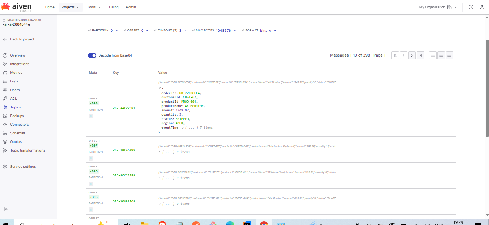
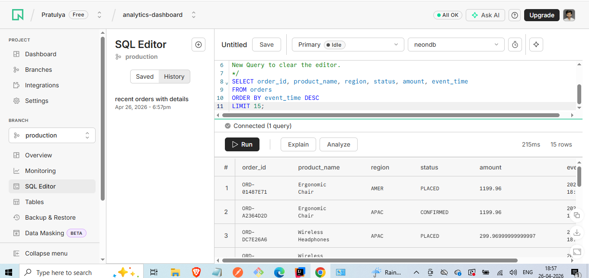
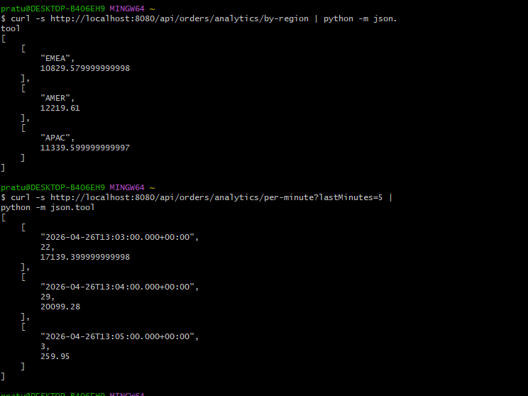

# OrderPulse: Event-Driven Order Analytics Pipeline

An event-driven order analytics service built with Spring Boot, Kafka, and PostgreSQL. Orders flow through a Kafka topic, get persisted asynchronously by an idempotent consumer with dead-letter queue routing, and are queryable via REST endpoints that expose revenue, regional breakdowns, and per-minute throughput.

---

## Architecture

```text
HTTP POST  ──►  Spring Controller  ──►  OrderService  ──►  KafkaProducer
                                                                 │
                                                                 ▼
                                                          Upstash Kafka
                                                       (order-events topic)
                                                                 │
                                                                 ▼
   GET endpoints  ◄──  PostgreSQL  ◄──  KafkaConsumer  ◄────────┘
   (analytics)         (Neon)          (saves to DB)
```

The producer fires-and-forgets: the HTTP request returns `202 Accepted` as soon as the event is queued for Kafka, decoupling the API response time from database writes. Persistence happens out-of-band via the consumer, which means the API stays fast even under load.

---

## Screenshots

**Producer + consumer running together**

The simulator generates a synthetic order every 2 seconds. The producer publishes to Kafka, the consumer picks it up and persists to Postgres — all observable in the application log:



**Events flowing through Kafka**

Messages visible in the Upstash console — same JSON payload that the producer sent, sitting in the `order-events` topic until the consumer drains it:



**Data persisted to Postgres**

After consumption, orders land in a Neon-hosted PostgreSQL database, indexed for fast analytics queries:



**Analytics endpoint output**

REST endpoints expose aggregations over the persisted data — total revenue, breakdowns by region/status, time-bucketed throughput:



---

## Tech stack

| Layer       | Choice                          | Why                                                                 |
|-------------|----------------------------------|---------------------------------------------------------------------|
| Runtime     | Java 17, Spring Boot 3.5         | LTS, broad ecosystem, current stable Spring Boot                    |
| Messaging   | Upstash Kafka (free tier)        | Real Kafka protocol, no credit card, serverless pricing             |
| Database    | Neon PostgreSQL 17 (serverless)  | Managed Postgres with generous free tier, scale-to-zero             |
| ORM         | Spring Data JPA + Hibernate      | Standard for Spring; entity mapping is straightforward for orders   |
| Build       | Maven                            | Familiar, plays well with Spring Boot starters                      |

---

## Design decisions worth discussing

**Why Kafka instead of synchronous DB writes?**  
The original use case is bursty: order events can spike during sales or product launches. Writing to Postgres synchronously on every request couples API latency to DB throughput. Kafka decouples them — the API only has to enqueue, and a separate consumer drains at whatever rate the DB can handle. It also gives us a replayable event log for free, which is useful for rebuilding read models or debugging.

**Why `ErrorHandlingDeserializer` wrapping `JsonDeserializer`?**  
Bare `JsonDeserializer` will infinite-loop on a poison-pill message: deserialization fails, the offset isn't committed, Kafka redelivers, fails again. `ErrorHandlingDeserializer` catches the deserialization exception, logs it, and lets the listener move on. Caught this the hard way during initial setup.

**Why dead-letter queue routing?**  
Invalid events that fail processing are routed to a separate DLQ topic instead of blocking the main pipeline. This prevents one malformed message from stalling all downstream consumers while preserving the event for inspection and replay.

**Why PostgreSQL range partitioning by month?**  
Time-series order data grows unboundedly. Without partitioning, queries like "last 7 days revenue" scan the entire table. Range partitioning by month means those queries touch only 1-2 partitions, keeping analytics fast as data grows.

**Why disable Spring's docker-compose integration?**  
The project ships a `compose.yaml` from the initial scaffolding, but everything runs against managed cloud services now (Neon, Upstash). Spring Boot would otherwise try to start Docker on every run and fail. Removed the dependency entirely so the failure mode is impossible.

---

## Endpoints

| Method | Path                                    | Description                              |
|--------|-----------------------------------------|------------------------------------------|
| POST   | `/api/orders/event`                     | Publish an order event to Kafka          |
| GET    | `/api/orders`                           | List all persisted orders                |
| GET    | `/api/orders/status/{status}`           | Filter by status                         |
| GET    | `/api/orders/analytics/revenue`         | Total revenue in last N hours            |
| GET    | `/api/orders/analytics/by-status`       | Order count grouped by status            |
| GET    | `/api/orders/analytics/by-region`       | Revenue grouped by region                |
| GET    | `/api/orders/analytics/per-minute`      | Order count per minute                   |

Example POST body:
```json
{
  "orderId": "ORD-001",
  "customerId": "CUST-001",
  "productId": "PROD-042",
  "productName": "Wireless Headphones",
  "amount": 99.99,
  "quantity": 2,
  "status": "PLACED",
  "region": "APAC"
}
```

---

## Running locally

Requires Java 17+, Maven, and accounts at [upstash.com](https://upstash.com) (free Kafka tier) and [neon.tech](https://neon.tech) (free Postgres).

1. Provision Kafka and Postgres in their respective consoles.
2. Copy your Upstash Kafka bootstrap URL and credentials into `application.yml`.
3. Copy your Neon PostgreSQL connection string into `application.yml`.
4. `./mvnw spring-boot:run`

---

## Roadmap

- [x] Phase 1: Domain model, Kafka producer/consumer, Postgres persistence, REST endpoints
- [x] Phase 2: Scheduled order simulator + analytics endpoint validation
- [ ] Phase 3: WebSocket push for live order feed
- [ ] Phase 4: Grafana Cloud dashboard backed by Postgres
- [ ] Phase 5: Deploy to Render/Railway

---

## What I learned

- Kafka client tuning: trusted packages, default type, and the difference between `__TypeId__` headers and explicit deserialization
- Spring Boot's `@KafkaListener` lifecycle and how unhandled exceptions cause infinite redelivery
- Why dead-letter queues matter in production: one poison-pill message can stall an entire consumer group without them
- PostgreSQL range partitioning tradeoffs: faster time-range queries at the cost of slightly more complex schema management
- `@ConditionalOnProperty` lets feature-flagged code ship cleanly: the simulator stays dormant in prod unless explicitly enabled, no commenting out beans
- Weighted random distributions matter more than they sound — uniform random looks fake, but a 50/20/15/10/3/2 split feels real